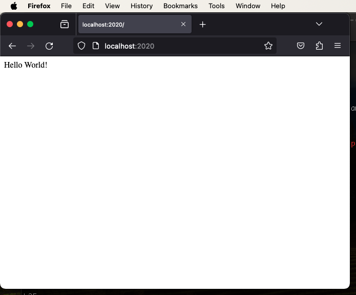
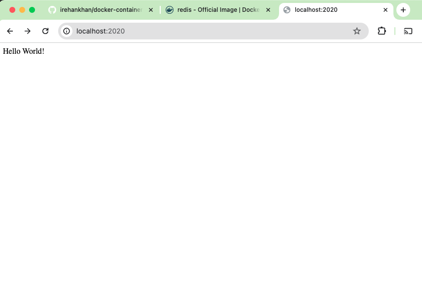
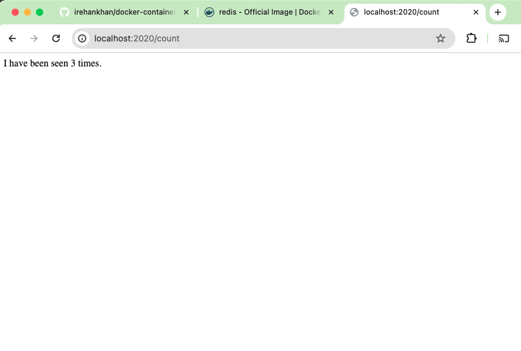

# Docker Compose

## Docker File Webapp

```Dockerfile
#Pull Base image from Docker
FROM python:3.7-alpine

# Set the working directory to /app
WORKDIR /app

#Copy main server runner file app-web.py to container path
COPY app-web.py /app/app-web.py
#Copy requirements/dependencies file to container path
COPY requirements.txt requirements.txt

#Install Dependencies
# RUN apk add --no-cache gcc musl-dev linux-headers
RUN pip install -r requirements.txt
# Install gcc and other dependencies
RUN apk add --no-cache gcc musl-dev linux-headers

# Set environment variables used by flask
ENV FLASK_APP=app-web.py
ENV FLASK_RUN_HOST=0.0.0.0

# the container is listening on below port 
# EXPOSE 5000

# Copy the current directory to the workdir . in the image.
COPY . .

#Command to run flask run in the container
CMD ["flask", "run"]
```

## Build Image

`docker build . -t irehankhan/webapp`

```sh
irehankhan@Rehans-Mac-mini docker_compose % docker build . -t irehankhan/webapp
[+] Building 1.0s (12/12) FINISHED                                                                                                                  docker:desktop-linux
 => [internal] load .dockerignore                                                                                                                                   0.0s
 => => transferring context: 2B                                                                                                                                     0.0s
 => [internal] load build definition from Dockerfile                                                                                                                0.0s
 => => transferring dockerfile: 814B                                                                                                                                0.0s
 => [internal] load metadata for docker.io/library/python:3.7-alpine                                                                                                0.9s
 => [1/7] FROM docker.io/library/python:3.7-alpine@sha256:f3d31c8677d03f0b3c724446077f229a6ce9d3ac430f5c08cd7dff00292048c3                                          0.0s
 => [internal] load build context                                                                                                                                   0.0s
 => => transferring context: 1.30kB                                                                                                                                 0.0s
 => CACHED [2/7] WORKDIR /app                                                                                                                                       0.0s
 => CACHED [3/7] COPY app-web.py /app/app-web.py                                                                                                                    0.0s
 => CACHED [4/7] COPY requirements.txt requirements.txt                                                                                                             0.0s
 => CACHED [5/7] RUN pip install -r requirements.txt                                                                                                                0.0s
 => CACHED [6/7] RUN apk add --no-cache gcc musl-dev linux-headers                                                                                                  0.0s
 => [7/7] COPY . .                                                                                                                                                  0.0s
 => exporting to image                                                                                                                                              0.0s
 => => exporting layers                                                                                                                                             0.0s
 => => writing image sha256:ccad9e991eea24934bd0262d6d7ee7548ce91fe36b6dd1d9a78b3a65fa9d0f3c                                                                        0.0s
 => => naming to docker.io/irehankhan/webapp                                                                                                                        0.0s

What's Next?
  View a summary of image vulnerabilities and recommendations → docker scout quickview
irehankhan@Rehans-Mac-mini docker_compose % docker run -d -p 2020:5000 --name webapp-container irehankhan/webapp
d85fa1be5cea37be2f96086be9029f510dbe9dd0ad26ebf195ee881e9ae68dfd
```

### Webapp Container
`docker run -d -p 2020:5000 --name webapp-container irehankhan/webapp`

```sh
irehankhan@Rehans-Mac-mini docker_compose % docker run -d -p 2020:5000 --name webapp-container irehankhan/webapp
b891295c207d78097ddf1a7106b88767a0203762d2e10aeca55a3c13ada26147
irehankhan@Rehans-Mac-mini docker_compose % docker ps   
CONTAINER ID   IMAGE               COMMAND       CREATED         STATUS         PORTS                    NAMES
b891295c207d   irehankhan/webapp   "flask run"   5 seconds ago   Up 5 seconds   0.0.0.0:2020->5000/tcp   webapp-container
```
## Code
```python
from flask import Flask
app = Flask(__name__)

@app.route('/')
def hello():
    return "Hello World!"

if __name__ == "__main__":
    app.run(host="0.0.0.0", port="2020")
```

## Test

Logs

```sh
irehankhan@Rehans-Mac-mini docker_compose % docker run -d -p 2020:5000 --name webapp-container irehankhan/webapp
d85fa1be5cea37be2f96086be9029f510dbe9dd0ad26ebf195ee881e9ae68dfd
irehankhan@Rehans-Mac-mini docker_compose % docker attach webapp-container
192.168.65.1 - - [10/Nov/2023 15:48:23] "GET / HTTP/1.1" 200 -
192.168.65.1 - - [10/Nov/2023 15:48:26] "GET / HTTP/1.1" 200 -
192.168.65.1 - - [10/Nov/2023 15:48:27] "GET / HTTP/1.1" 200 -
192.168.65.1 - - [10/Nov/2023 15:48:35] "GET / HTTP/1.1" 200 -
192.168.65.1 - - [10/Nov/2023 15:48:42] "GET / HTTP/1.1" 200 -
192.168.65.1 - - [10/Nov/2023 15:48:43] "GET / HTTP/1.1" 200 -
```


## Docker file Redis

```dockerfile
# Pull Base image from Docker
FROM redis

# Run redis server
CMD ["redis-server"]
```

logs

irehankhan@Rehans-Mac-mini docker_compose % docker build . -t irehankhan/redis-db -f Dockerfile-redis

[+] Building 31.7s (6/6) FINISHED                                                                                                                   docker:desktop-linux
 => [internal] load .dockerignore                                                                                                                                   0.0s
 => => transferring context: 2B                                                                                                                                     0.0s
 => [internal] load build definition from Dockerfile-redis                                                                                                          0.0s
 => => transferring dockerfile: 124B                                                                                                                                0.0s
 => [internal] load metadata for docker.io/library/redis:latest                                                                                                     4.0s
 => [auth] library/redis:pull token for registry-1.docker.io                                                                                                        0.0s
 => [1/1] FROM docker.io/library/redis@sha256:d2f4d823a498f366c540b81e6b69bce397062f980f2e42340402225af0d9b5ab                                                     27.7s
 => => resolve docker.io/library/redis@sha256:d2f4d823a498f366c540b81e6b69bce397062f980f2e42340402225af0d9b5ab                                                      0.0s
 => => sha256:9331e5657496ead3216999b6f4effaa9781475eba24163e9a33970b4fad65f28 1.99kB / 1.99kB                                                                      0.0s
 => => sha256:71b55c03cd63a316ab14ede434b879fbee364dc591e843c93e73ec10bf2a534e 1.37MB / 1.37MB                                                                      3.1s
 => => sha256:d2f4d823a498f366c540b81e6b69bce397062f980f2e42340402225af0d9b5ab 7.55kB / 7.55kB                                                                      0.0s
 => => sha256:720b987633aecdf62d70e3827fd35a03992c62854134d045044e07cc5ca8629b 6.94kB / 6.94kB                                                                      0.0s
 => => sha256:3e7e9ad93cf6b1248afb9cbcd552f247529f92a4f2edef7dd873a5607d6d5c22 1.10kB / 1.10kB                                                                      0.2s
 => => sha256:f4eaed5cee6c44170856260ed680fe629c4fd29d36d6c00b0f797481037cfc82 19.85MB / 19.85MB                                                                   27.1s
 => => extracting sha256:3e7e9ad93cf6b1248afb9cbcd552f247529f92a4f2edef7dd873a5607d6d5c22                                                                           0.0s
 => => sha256:e9345f7700f5d5126e30f2e02969ad39a8c9e6fb4b077cd4214979dfd9655f20 97B / 97B                                                                            0.5s
 => => sha256:4f4fb700ef54461cfa02571ae0db9a0dc1e0cdb5577484a6d75e68dc38e8acc1 32B / 32B                                                                            0.8s
 => => sha256:d31553c614fda133fbe687531405264c8742667d4ad9a8b750355648bb83eafe 572B / 572B                                                                          1.0s
 => => extracting sha256:71b55c03cd63a316ab14ede434b879fbee364dc591e843c93e73ec10bf2a534e                                                                           0.0s
 => => extracting sha256:f4eaed5cee6c44170856260ed680fe629c4fd29d36d6c00b0f797481037cfc82                                                                           0.5s
 => => extracting sha256:e9345f7700f5d5126e30f2e02969ad39a8c9e6fb4b077cd4214979dfd9655f20                                                                           0.0s
 => => extracting sha256:4f4fb700ef54461cfa02571ae0db9a0dc1e0cdb5577484a6d75e68dc38e8acc1                                                                           0.0s
 => => extracting sha256:d31553c614fda133fbe687531405264c8742667d4ad9a8b750355648bb83eafe                                                                           0.0s
 => exporting to image                                                                                                                                              0.0s
 => => exporting layers                                                                                                                                             0.0s
 => => writing image sha256:dec761825d45c442c61c1fbf97d6fcfcccd163b2fd48490a903917e87ff498fc                                                                        0.0s
 => => naming to docker.io/irehankhan/redis-db                                                                                                                      0.0s

What's Next?
  View a summary of image vulnerabilities and recommendations → docker scout quickview


### Redis Container

irehankhan@Rehans-Mac-mini docker_compose % docker run --name redis-db-container irehankhan/redis-db
1:C 10 Nov 2023 16:34:52.200 # WARNING Memory overcommit must be enabled! Without it, a background save or replication may fail under low memory condition. Being disabled, it can also cause failures without low memory condition, see https://github.com/jemalloc/jemalloc/issues/1328. To fix this issue add 'vm.overcommit_memory = 1' to /etc/sysctl.conf and then reboot or run the command 'sysctl vm.overcommit_memory=1' for this to take effect.
1:C 10 Nov 2023 16:34:52.201 * oO0OoO0OoO0Oo Redis is starting oO0OoO0OoO0Oo
1:C 10 Nov 2023 16:34:52.201 * Redis version=7.2.3, bits=64, commit=00000000, modified=0, pid=1, just started
1:C 10 Nov 2023 16:34:52.201 # Warning: no config file specified, using the default config. In order to specify a config file use redis-server /path/to/redis.conf
1:M 10 Nov 2023 16:34:52.201 * monotonic clock: POSIX clock_gettime
1:M 10 Nov 2023 16:34:52.202 * Running mode=standalone, port=6379.
1:M 10 Nov 2023 16:34:52.202 * Server initialized
1:M 10 Nov 2023 16:34:52.202 * Ready to accept connections tcp

irehankhan@Rehans-Mac-mini docker_compose % docker ps -a
CONTAINER ID   IMAGE                 COMMAND                  CREATED         STATUS                     PORTS     NAMES
42983cb17a48   irehankhan/redis-db   "docker-entrypoint.s…"   2 minutes ago   Exited (1) 5 seconds ago             redis-db-container
d85fa1be5cea   irehankhan/webapp     "flask run"              8 minutes ago   Exited (0) 5 minutes ago             webapp-container

## Docker Compose up

### Docker File Modified

```Dockerfile
version: "3.8"
services:
  webapp:
    build:
      context: .
      dockerfile: Dockerfile
    ports:
      - "2020:5000"
    networks:
      - overlay
  redis:
    build:
      context: .
      dockerfile: Dockerfile-redis
    networks:
      - overlay
networks:
  overlay:
```

```sh
irehankhan@Rehans-Mac-mini docker_compose % docker-compose up
[+] Building 3.2s (19/19) FINISHED                                                                                                                  docker:desktop-linux
 => [webapp internal] load .dockerignore                                                                                                                            0.0s
 => => transferring context: 2B                                                                                                                                     0.0s
 => [webapp internal] load build definition from Dockerfile                                                                                                         0.0s
 => => transferring dockerfile: 764B                                                                                                                                0.0s
 => [webapp internal] load metadata for docker.io/library/python:3.7-alpine                                                                                         3.1s
 => [redis internal] load .dockerignore                                                                                                                             0.0s
 => => transferring context: 2B                                                                                                                                     0.0s
 => [redis internal] load build definition from Dockerfile-redis                                                                                                    0.0s
 => => transferring dockerfile: 124B                                                                                                                                0.0s
 => [redis internal] load metadata for docker.io/library/redis:latest                                                                                               3.1s
 => [webapp auth] library/python:pull token for registry-1.docker.io                                                                                                0.0s
 => [redis auth] library/redis:pull token for registry-1.docker.io                                                                                                  0.0s
 => [webapp 1/7] FROM docker.io/library/python:3.7-alpine@sha256:f3d31c8677d03f0b3c724446077f229a6ce9d3ac430f5c08cd7dff00292048c3                                   0.0s
 => [webapp internal] load build context                                                                                                                            0.0s
 => => transferring context: 1.15kB                                                                                                                                 0.0s
 => CACHED [redis 1/1] FROM docker.io/library/redis@sha256:d2f4d823a498f366c540b81e6b69bce397062f980f2e42340402225af0d9b5ab                                         0.0s
 => [redis] exporting to image                                                                                                                                      0.0s
 => => exporting layers                                                                                                                                             0.0s
 => => writing image sha256:e3eb4521004976ebf5b09509f2efc4c0f79398c9b2814d6812d5561c04bea7e4                                                                        0.0s
 => => naming to docker.io/library/docker_compose-redis                                                                                                             0.0s
 => CACHED [webapp 2/7] WORKDIR /app                                                                                                                                0.0s
 => CACHED [webapp 3/7] COPY app-web-db.py /app/app-web-db.py                                                                                                       0.0s
 => CACHED [webapp 4/7] COPY requirements.txt requirements.txt                                                                                                      0.0s
 => CACHED [webapp 5/7] RUN pip install -r requirements.txt                                                                                                         0.0s
 => CACHED [webapp 6/7] RUN apk add --no-cache gcc musl-dev linux-headers                                                                                           0.0s
 => [webapp 7/7] COPY . .                                                                                                                                           0.0s
 => [webapp] exporting to image                                                                                                                                     0.0s
 => => exporting layers                                                                                                                                             0.0s
 => => writing image sha256:a54266135c874b4ceadf1d1a7a78e318f0561c23530337da095b826e0f0ffbe0                                                                        0.0s
 => => naming to docker.io/library/docker_compose-webapp                                                                                                            0.0s
WARN[0003] Found orphan containers ([docker_compose-redis-db-1]) for this project. If you removed or renamed this service in your compose file, you can run this command with the --remove-orphans flag to clean it up. 
[+] Running 3/0
 ✔ Network docker_compose_overlay     Created                                                                                                                       0.0s 
 ✔ Container docker_compose-redis-1   Created                                                                                                                       0.0s 
 ✔ Container docker_compose-webapp-1  Created                                                                                                                       0.0s 
Attaching to docker_compose-redis-1, docker_compose-webapp-1
docker_compose-redis-1   | 1:C 10 Nov 2023 17:26:24.698 # WARNING Memory overcommit must be enabled! Without it, a background save or replication may fail under low memory condition. Being disabled, it can also cause failures without low memory condition, see https://github.com/jemalloc/jemalloc/issues/1328. To fix this issue add 'vm.overcommit_memory = 1' to /etc/sysctl.conf and then reboot or run the command 'sysctl vm.overcommit_memory=1' for this to take effect.
docker_compose-redis-1   | 1:C 10 Nov 2023 17:26:24.700 * oO0OoO0OoO0Oo Redis is starting oO0OoO0OoO0Oo
docker_compose-redis-1   | 1:C 10 Nov 2023 17:26:24.700 * Redis version=7.2.3, bits=64, commit=00000000, modified=0, pid=1, just started
docker_compose-redis-1   | 1:C 10 Nov 2023 17:26:24.700 # Warning: no config file specified, using the default config. In order to specify a config file use redis-server /path/to/redis.conf
docker_compose-redis-1   | 1:M 10 Nov 2023 17:26:24.700 * monotonic clock: POSIX clock_gettime
docker_compose-redis-1   | 1:M 10 Nov 2023 17:26:24.700 * Running mode=standalone, port=6379.
docker_compose-redis-1   | 1:M 10 Nov 2023 17:26:24.701 * Server initialized
docker_compose-redis-1   | 1:M 10 Nov 2023 17:26:24.701 * Ready to accept connections tcp
docker_compose-webapp-1  |  * Serving Flask app 'app-web-db.py'
docker_compose-webapp-1  |  * Debug mode: off
docker_compose-webapp-1  | WARNING: This is a development server. Do not use it in a production deployment. Use a production WSGI server instead.
docker_compose-webapp-1  |  * Running on all addresses (0.0.0.0)
docker_compose-webapp-1  |  * Running on http://127.0.0.1:5000
docker_compose-webapp-1  |  * Running on http://172.24.0.2:5000
docker_compose-webapp-1  | Press CTRL+C to quit
docker_compose-webapp-1  | 192.168.65.1 - - [10/Nov/2023 17:26:39] "GET / HTTP/1.1" 200 -
docker_compose-webapp-1  | 192.168.65.1 - - [10/Nov/2023 17:26:42] "GET /count HTTP/1.1" 200 -
docker_compose-webapp-1  | 192.168.65.1 - - [10/Nov/2023 17:26:46] "GET /count HTTP/1.1" 200 -
docker_compose-webapp-1  | 192.168.65.1 - - [10/Nov/2023 17:26:46] "GET /count HTTP/1.1" 200 -
docker_compose-webapp-1  | 192.168.65.1 - - [10/Nov/2023 17:26:46] "GET /count HTTP/1.1" 200 -
docker_compose-webapp-1  | 192.168.65.1 - - [10/Nov/2023 17:26:47] "GET /count HTTP/1.1" 200 -
```




## Docker Compose down and up

```sh
irehankhan@Rehans-Mac-mini docker_compose % docker-compose down      
[+] Running 3/0
 ✔ Container docker_compose-redis-1   Removed                                                                                                                       0.0s 
 ✔ Container docker_compose-webapp-1  Removed                                                                                                                       0.0s 
 ✔ Network docker_compose_overlay     Removed                                                                                                                       0.1s 
irehankhan@Rehans-Mac-mini docker_compose % docker-compose up        
[+] Building 0.0s (0/0)                                                                                                                             docker:desktop-linux
[+] Running 3/0
 ✔ Network docker_compose_overlay     Created                                                                                                                       0.0s 
 ✔ Container docker_compose-redis-1   Created                                                                                                                       0.0s 
 ✔ Container docker_compose-webapp-1  Created                                                                                                                       0.0s 
Attaching to docker_compose-redis-1, docker_compose-webapp-1
docker_compose-redis-1   | 1:C 10 Nov 2023 17:42:04.442 # WARNING Memory overcommit must be enabled! Without it, a background save or replication may fail under low memory condition. Being disabled, it can also cause failures without low memory condition, see https://github.com/jemalloc/jemalloc/issues/1328. To fix this issue add 'vm.overcommit_memory = 1' to /etc/sysctl.conf and then reboot or run the command 'sysctl vm.overcommit_memory=1' for this to take effect.
docker_compose-redis-1   | 1:C 10 Nov 2023 17:42:04.443 * oO0OoO0OoO0Oo Redis is starting oO0OoO0OoO0Oo
docker_compose-redis-1   | 1:C 10 Nov 2023 17:42:04.443 * Redis version=7.2.3, bits=64, commit=00000000, modified=0, pid=1, just started
docker_compose-redis-1   | 1:C 10 Nov 2023 17:42:04.443 # Warning: no config file specified, using the default config. In order to specify a config file use redis-server /path/to/redis.conf
docker_compose-redis-1   | 1:M 10 Nov 2023 17:42:04.444 * monotonic clock: POSIX clock_gettime
docker_compose-redis-1   | 1:M 10 Nov 2023 17:42:04.444 * Running mode=standalone, port=6379.
docker_compose-redis-1   | 1:M 10 Nov 2023 17:42:04.444 * Server initialized
docker_compose-redis-1   | 1:M 10 Nov 2023 17:42:04.444 * Ready to accept connections tcp
docker_compose-webapp-1  |  * Serving Flask app 'app-web-db.py'
docker_compose-webapp-1  |  * Debug mode: off
docker_compose-webapp-1  | WARNING: This is a development server. Do not use it in a production deployment. Use a production WSGI server instead.
docker_compose-webapp-1  |  * Running on all addresses (0.0.0.0)
docker_compose-webapp-1  |  * Running on http://127.0.0.1:5000
docker_compose-webapp-1  |  * Running on http://172.25.0.3:5000
docker_compose-webapp-1  | Press CTRL+C to quit
docker_compose-webapp-1  | 192.168.65.1 - - [10/Nov/2023 17:42:08] "GET /count HTTP/1.1" 200 -
docker_compose-webapp-1  | 192.168.65.1 - - [10/Nov/2023 17:42:11] "GET /count HTTP/1.1" 200 -
docker_compose-webapp-1  | 192.168.65.1 - - [10/Nov/2023 17:42:13] "GET /count HTTP/1.1" 200 -
```
## Reset



## Docker Compose Replicate

```sh
[+] Stopping 2/2
 ✔ Container docker_compose-redis-1   Stopped                                                                                                                       0.2s 
 ✔ Container docker_compose-webapp-1  Stopped                                                                                                                      10.1s 
canceled
irehankhan@Rehans-Mac-mini docker_compose % docker-compose down      
service "redis" refers to undefined volume db_data: invalid compose project
irehankhan@Rehans-Mac-mini docker_compose % docker-compose down      
[+] Running 3/0
 ✔ Container docker_compose-redis-1   Removed                                                                                                                       0.0s 
 ✔ Container docker_compose-webapp-1  Removed                                                                                                                       0.0s 
 ✔ Network docker_compose_overlay     Removed                                                                                                                       0.1s 
irehankhan@Rehans-Mac-mini docker_compose % docker-compose rm        
No stopped containers
irehankhan@Rehans-Mac-mini docker_compose % docker-compose up --build
[+] Building 3.2s (19/19) FINISHED                                                                                                                  docker:desktop-linux
 => [redis internal] load .dockerignore                                                                                                                             0.0s
 => => transferring context: 2B                                                                                                                                     0.0s
 => [redis internal] load build definition from Dockerfile-redis                                                                                                    0.0s
 => => transferring dockerfile: 124B                                                                                                                                0.0s
 => [redis internal] load metadata for docker.io/library/redis:latest                                                                                               3.2s
 => [webapp internal] load .dockerignore                                                                                                                            0.0s
 => => transferring context: 2B                                                                                                                                     0.0s
 => [webapp internal] load build definition from Dockerfile                                                                                                         0.0s
 => => transferring dockerfile: 764B                                                                                                                                0.0s
 => [webapp internal] load metadata for docker.io/library/python:3.7-alpine                                                                                         2.4s
 => [redis auth] library/redis:pull token for registry-1.docker.io                                                                                                  0.0s
 => [webapp auth] library/python:pull token for registry-1.docker.io                                                                                                0.0s
 => [webapp 1/7] FROM docker.io/library/python:3.7-alpine@sha256:f3d31c8677d03f0b3c724446077f229a6ce9d3ac430f5c08cd7dff00292048c3                                   0.0s
 => [webapp internal] load build context                                                                                                                            0.0s
 => => transferring context: 1.36kB                                                                                                                                 0.0s
 => CACHED [webapp 2/7] WORKDIR /app                                                                                                                                0.0s
 => CACHED [webapp 3/7] COPY app-web-db.py /app/app-web-db.py                                                                                                       0.0s
 => CACHED [webapp 4/7] COPY requirements.txt requirements.txt                                                                                                      0.0s
 => CACHED [webapp 5/7] RUN pip install -r requirements.txt                                                                                                         0.0s
 => CACHED [webapp 6/7] RUN apk add --no-cache gcc musl-dev linux-headers                                                                                           0.0s
 => [webapp 7/7] COPY . .                                                                                                                                           0.0s
 => [webapp] exporting to image                                                                                                                                     0.0s
 => => exporting layers                                                                                                                                             0.0s
 => => writing image sha256:0eea51fdba3b5cabff225547e3ae624851ffc43934fae876d2a5d0e51d481b7e                                                                        0.0s
 => => naming to docker.io/library/docker_compose-webapp                                                                                                            0.0s
 => CACHED [redis 1/1] FROM docker.io/library/redis@sha256:d2f4d823a498f366c540b81e6b69bce397062f980f2e42340402225af0d9b5ab                                         0.0s
 => [redis] exporting to image                                                                                                                                      0.0s
 => => exporting layers                                                                                                                                             0.0s
 => => writing image sha256:e3eb4521004976ebf5b09509f2efc4c0f79398c9b2814d6812d5561c04bea7e4                                                                        0.0s
 => => naming to docker.io/library/docker_compose-redis                                                                                                             0.0s
[+] Running 5/5
 ✔ Network docker_compose_overlay     Created                                                                                                                       0.0s 
 ✔ Container docker_compose-webapp-2  Created                                                                                                                       0.0s 
 ✔ Container docker_compose-redis-1   Created                                                                                                                       0.0s 
 ✔ Container docker_compose-webapp-1  Created                                                                                                                       0.0s 
 ✔ Container docker_compose-redis-2   Created                                                                                                                       0.0s 
Attaching to docker_compose-redis-1, docker_compose-redis-2, docker_compose-webapp-1, docker_compose-webapp-2
docker_compose-redis-2   | 1:C 10 Nov 2023 18:45:16.993 # WARNING Memory overcommit must be enabled! Without it, a background save or replication may fail under low memory condition. Being disabled, it can also cause failures without low memory condition, see https://github.com/jemalloc/jemalloc/issues/1328. To fix this issue add 'vm.overcommit_memory = 1' to /etc/sysctl.conf and then reboot or run the command 'sysctl vm.overcommit_memory=1' for this to take effect.
docker_compose-redis-2   | 1:C 10 Nov 2023 18:45:16.994 * oO0OoO0OoO0Oo Redis is starting oO0OoO0OoO0Oo
docker_compose-redis-2   | 1:C 10 Nov 2023 18:45:16.994 * Redis version=7.2.3, bits=64, commit=00000000, modified=0, pid=1, just started
docker_compose-redis-2   | 1:C 10 Nov 2023 18:45:16.994 # Warning: no config file specified, using the default config. In order to specify a config file use redis-server /path/to/redis.conf
docker_compose-redis-2   | 1:M 10 Nov 2023 18:45:16.994 * monotonic clock: POSIX clock_gettime
docker_compose-redis-2   | 1:M 10 Nov 2023 18:45:16.995 * Running mode=standalone, port=6379.
docker_compose-redis-2   | 1:M 10 Nov 2023 18:45:16.996 * Server initialized
docker_compose-redis-2   | 1:M 10 Nov 2023 18:45:16.996 * Ready to accept connections tcp
docker_compose-webapp-1  |  * Serving Flask app 'app-web-db.py'
docker_compose-webapp-1  |  * Debug mode: off
docker_compose-webapp-1  | WARNING: This is a development server. Do not use it in a production deployment. Use a production WSGI server instead.
docker_compose-webapp-1  |  * Running on all addresses (0.0.0.0)
docker_compose-webapp-1  |  * Running on http://127.0.0.1:5000
docker_compose-webapp-1  |  * Running on http://172.19.0.2:5000
docker_compose-webapp-1  | Press CTRL+C to quit
```


